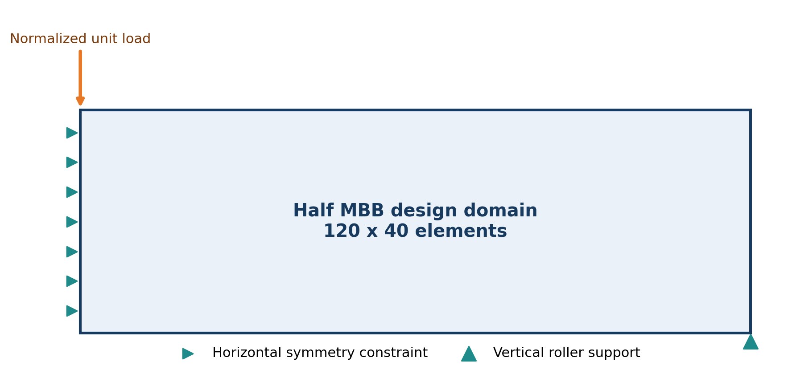
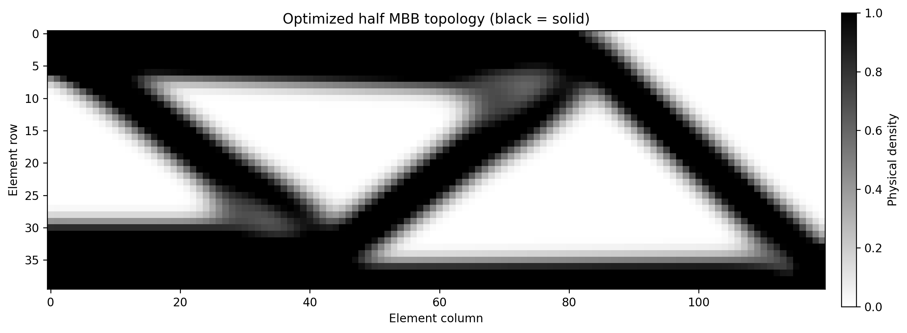
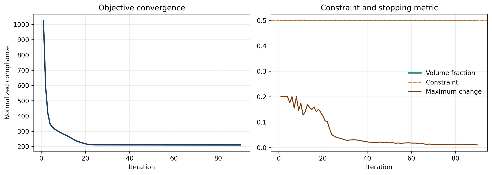

# Project 1: Formulation and Solution of a SIMP Topology-Optimization Problem

**Course:** MAE 598/494 Design Optimization  
**Team:** OptiForge  
**Member:** Kangzheng Liu  
**Official brief:** [Project 1: Optimization Problem Formulation](https://designinformaticslab.github.io/DesignOptimization2025/project1_optimization_formulation.html)

## 1. Problem Identification and Motivation

Structural engineers frequently need to create load-bearing members that are stiff but light. Examples include bridge cross-members, machine frames, robotic supports, and aerospace brackets. Adding material generally increases stiffness, but it also increases mass, material consumption, and manufacturing cost. The engineering decision is therefore not only how much material to use, but where that material contributes most effectively to the load path.

This project considers the classical Messerschmitt-Bölkow-Blohm (MBB) beam benchmark. Symmetry permits optimization of one half of the beam. The rectangular design domain has an aspect ratio of 3:1 and is discretized into 120 by 40 square finite elements. A normalized downward unit load is applied at the upper-left corner. Horizontal displacement is suppressed along the left symmetry boundary, and vertical displacement is suppressed at the lower-right roller support.

The design goal is to find the material distribution with minimum compliance while using no more than 50% of the full design-domain volume. This benchmark represents the material-allocation decision faced in lightweight structural design while remaining simple enough for a transparent implementation and verification.

## 2. Decision Variables

The domain contains

$$
N = 120 \times 40 = 4800
$$

finite elements. Each element has a continuous relative-density design variable:

$$
0 \leq \rho_e \leq 1, \qquad e=1,\ldots,N.
$$

The complete design vector is

$$
\boldsymbol{\rho} = [\rho_1,\rho_2,\ldots,\rho_N]^{\mathsf T} \in \mathbb{R}^{4800}.
$$

A value of zero represents void and a value of one represents solid material. Intermediate values are allowed during continuous optimization and are discouraged through SIMP penalization.

| Symbol | Definition | Role and type | Units or dimensions | Value or bounds |
|---|---|---|---|---|
| `rho_e` | Relative density of element `e` | Continuous design variable | Dimensionless scalar | 0 to 1 |
| `rho` | All element densities | Continuous design vector | 4800 entries | Box-constrained |
| `u` | Global nodal displacement | FEM state vector | 9922 normalized DOFs | Determined by equilibrium |
| `F` | Applied load | Fixed parameter | 9922 entries | One normalized downward unit load |
| `v_e` | Element volume | Fixed parameter | Normalized volume | Equal for all elements |
| `f_v` | Maximum material fraction | Fixed parameter | Dimensionless | 0.50 |

The displacement vector is a state variable rather than a freely selected design variable. Once the density field is specified, the finite-element equilibrium equations determine the displacement.

### 2.1 SIMP material interpolation

The element modulus is interpolated using the modified SIMP relation:

$$
E_e(\rho_e) = E_{\min} + \rho_e^p(E_0-E_{\min}).
$$

The numerical settings are

$$
E_0=1, \qquad E_{\min}=10^{-9}, \qquad p=3.
$$

Here, `E_0` is the normalized solid modulus. The very small value `E_min` prevents the global stiffness matrix from becoming singular when elements approach void. The exponent `p=3` makes intermediate-density material inefficient and drives the solution toward a predominantly solid-void topology.

## 3. Objective Function

The optimization minimizes structural compliance:

$$
\min_{\boldsymbol{\rho}} C(\boldsymbol{\rho}).
$$

For the prescribed load, compliance is

$$
C(\boldsymbol{\rho}) = \mathbf{F}^{\mathsf T}\mathbf{u}(\boldsymbol{\rho}).
$$

Using element strain energies, the same objective is written explicitly as

$$
C(\boldsymbol{\rho}) =
\sum_{e=1}^{N}
\left[E_{\min}+\rho_e^p(E_0-E_{\min})\right]
\mathbf{u}_e^{\mathsf T}\mathbf{k}_e^0\mathbf{u}_e.
$$

The matrix `k_e^0` is the unit-modulus stiffness matrix of a four-node square plane-stress element, and `u_e` contains its eight displacement degrees of freedom. Lower compliance means smaller load-point displacement and greater global stiffness. Because the benchmark uses normalized modulus, load, dimensions, and thickness, the reported compliance is also normalized rather than expressed in joules or newton-millimeters.

## 4. Constraints

### 4.1 Equality constraints

Static finite-element equilibrium must hold:

$$
\mathbf{K}(\boldsymbol{\rho})\mathbf{u}=\mathbf{F}.
$$

The global stiffness matrix is assembled from the density-dependent element matrices:

$$
\mathbf{K}(\boldsymbol{\rho})=
\sum_{e=1}^{N}
\mathbf{A}_e^{\mathsf T}
\left[E_{\min}+\rho_e^p(E_0-E_{\min})\right]
\mathbf{k}_e^0
\mathbf{A}_e.
$$

The boundary conditions are

$$
u_x=0 \quad \text{on the left symmetry boundary},
$$

and

$$
u_y=0 \quad \text{at the lower-right roller support}.
$$

These equations enforce force balance, symmetry, and removal of rigid-body motion.

### 4.2 Inequality constraint

The design may use no more than half of the full-domain material:

$$
\frac{V(\boldsymbol{\rho})}{V_0}
=
\frac{\sum_{e=1}^{N}v_e\rho_e}{\sum_{e=1}^{N}v_e}
\leq 0.50.
$$

Because all elements have equal volume, this reduces to

$$
\frac{1}{N}\sum_{e=1}^{N}\rho_e \leq 0.50.
$$

The constraint expresses the material or mass budget. It is expected to be active because additional material reduces compliance.

### 4.3 Variable bounds

Every design variable must satisfy

$$
0 \leq \rho_e \leq 1.
$$

### 4.4 Complete optimization statement

The complete finite-dimensional problem is:

$$
\min_{\boldsymbol{\rho},\mathbf{u}}
\quad \mathbf{F}^{\mathsf T}\mathbf{u}.
$$

It is subject to the equilibrium constraint

$$
\mathbf{K}(\boldsymbol{\rho})\mathbf{u}=\mathbf{F},
$$

the material constraint

$$
\frac{1}{N}\sum_{e=1}^{N}\rho_e \leq 0.50,
$$

the density bounds

$$
0 \leq \rho_e \leq 1, \qquad e=1,\ldots,N,
$$

and the stated symmetry and support boundary conditions.

## 5. Problem Classification

This formulation is classified as follows:

- **Continuous:** the 4800 density variables can take any real value between zero and one.
- **Single-objective:** only compliance is minimized.
- **Constrained:** the problem contains finite-element equality constraints, one material-volume inequality, boundary conditions, and density bounds.
- **Nonlinear:** stiffness depends nonlinearly on density through the cubic SIMP interpolation, and displacement satisfies `u(rho) = K(rho)^(-1) F`.
- **Nonconvex:** the SIMP exponent `p=3` introduces a nonconvex interpolation, so different initializations or numerical choices can lead to different local optima.
- **Deterministic:** loads, supports, material parameters, and the mesh are fixed; no random variables appear.
- **Differentiable over the regularized domain:** the positive void modulus keeps the equilibrium solve well-defined and enables analytical compliance sensitivities.
- **PDE/FE-constrained:** structural equilibrium is embedded in every objective evaluation.

The ideal solid-void problem would impose binary densities and would be combinatorial. SIMP replaces that problem with a differentiable continuous relaxation, while penalization encourages a nearly binary result.

## 6. Assumptions and Simplifications

The formulation uses the following assumptions:

- The material is homogeneous, isotropic, and linear elastic.
- Strains and displacements are small.
- Loading is static and contains one load case.
- The model uses four-node square plane-stress elements with unit normalized thickness.
- Geometry, load location, and supports do not change during optimization.
- Material properties, dimensions, and loads are normalized.
- A sensitivity filter with radius 3.5 elements is used to reduce checkerboards and mesh-scale features.
- Stress, local buckling, fatigue, contact, manufacturing constraints, uncertainty, and three-dimensional behavior are excluded.
- The stopping condition is a maximum design-variable change of 0.01, so the result is numerically converged to the tolerance rather than proven globally optimal.

Consequently, this result demonstrates optimization formulation and load-path discovery; it is not a production-ready design. A real component would require dimensional material data, stress and buckling checks, manufacturing constraints, multiple load cases, and higher-fidelity validation.

## 7. Computational Solution and Results

### 7.1 Solution methodology

The solution follows the classic 88-line topology-optimization method of Andreassen et al. The official DTU example call is reproduced:

~~~text
top88(120, 40, 0.5, 3.0, 3.5, 1)
~~~

The final argument selects the sensitivity filter. The expanded [Python implementation](../src/top88.py) performs the following operations:

1. Precompute the element stiffness matrix, element-to-DOF map, and sparse filter matrix.
2. Initialize all densities to the allowed volume fraction of 0.50.
3. Assemble the sparse global stiffness matrix and solve the free displacement DOFs.
4. Compute compliance and analytical element sensitivities.
5. Apply the distance-weighted sensitivity filter.
6. Update the density variables with the move-limited Optimality Criteria method; use bisection on the Lagrange multiplier to enforce the volume constraint.
7. Repeat until the largest density change is no greater than 0.01.

### 7.2 Numerical results

| Quantity | Result |
|---|---:|
| Mesh | 120 by 40 elements |
| Design variables | 4800 |
| Displacement DOFs | 9922 |
| Iterations | 90 |
| Initial normalized compliance | 1026.8431 |
| Final normalized compliance | 210.0406 |
| Compliance reduction | 79.55% |
| Target volume fraction | 0.500000 |
| Final volume fraction | 0.499938 |
| Final maximum density change | 0.009922 |
| Elements with `0.1 < rho < 0.9` | 24.77% |
| Measured runtime in the recorded run | approximately 6.6 s |

The optimized design forms a set of truss-like upper, lower, and diagonal load paths. Material is removed from regions that contribute little to transferring the applied load to the supports. The volume constraint is satisfied and essentially active: the final material fraction differs from the 0.50 target by about 0.0062 percentage points.

The nonzero gray fraction is expected because this educational configuration uses a sensitivity filter but no Heaviside projection. The transition bands also reflect the relatively large filter radius of 3.5 elements. A projection method could produce a sharper solid-void design but would change the selected formulation and introduce additional continuation parameters.

Compliance decreases rapidly during the first 20 iterations and then approaches a plateau. Small late-stage oscillations arise from the filtered sensitivities and OC updates. The maximum density change eventually falls below the specified tolerance while the volume remains at its active constraint.

### 7.3 Code and reproducibility

From the repository root, install the scientific Python dependencies and run:

~~~bash
pip install -r requirements.txt
python projects/01_problem_formulation/src/top88.py
~~~

The command regenerates all submitted computational artifacts:

- [Convergence history](../results/history.csv)
- [Final physical-density field](../results/final_density.csv)
- [Machine-readable run summary](../results/summary.json)
- [Problem setup](../figures/problem_setup.png)
- [Final topology](../figures/final_topology.png)
- [Convergence plots](../figures/convergence.png)

The implementation is deterministic and does not use random initialization. Runtime is hardware- and software-dependent, so it is reported only as a reproducibility record rather than an algorithmic performance claim.

## References

1. MAE 598/494, [Project 1: Optimization Problem Formulation](https://designinformaticslab.github.io/DesignOptimization2025/project1_optimization_formulation.html).
2. E. Andreassen, A. Clausen, M. Schevenels, B. S. Lazarov, and O. Sigmund, “Efficient topology optimization in MATLAB using 88 lines of code,” *Structural and Multidisciplinary Optimization*, 43(1), 1–16, 2011. [doi:10.1007/s00158-010-0594-7](https://doi.org/10.1007/s00158-010-0594-7).
3. DTU TopOpt, [Efficient topology optimization in MATLAB using 88 lines of code](https://www.topopt.mek.dtu.dk/apps-and-software/efficient-topology-optimization-in-matlab).
