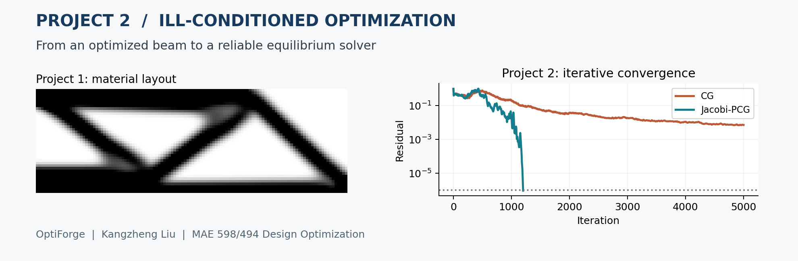

# Project 2 — Ill-Conditioned Optimization



**Solving the MBB Beam Equilibrium Problem**

Kangzheng Liu · OptiForge · MAE 598/494 Design Optimization

Project 1 optimized the beam's material layout. Project 2 studies the equilibrium solve within that workflow: why gradient descent slows as the mesh is refined, and how CG and Jacobi preconditioning improve iterative convergence. The report includes a direct comparison with the Project 1 displacement solution.

- **[Submission report](report/report.md)**
- [Official assignment](https://designinformaticslab.github.io/DesignOptimization2025/project2.html)
- [Code](src/conditioning_demo.py) · [Numerical results](results/) · [Figures](figures/)

## Reproduce

Use Python 3.12 and run from the repository root:

```bash
python -m pip install -r projects/02_gradient_descent/requirements.txt
python projects/02_gradient_descent/src/conditioning_demo.py
```

The script reads the Project 1 finite-element implementation and saved density field, then writes the Project 2 results and figures. To save a rerun separately, add `--output /tmp/mae598-project2`.
