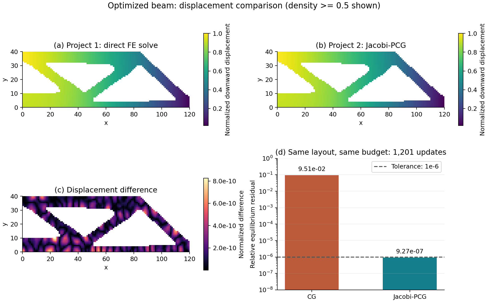

# Project 2: Solving the MBB Beam Equilibrium Problem

**Kangzheng Liu · OptiForge · MAE 598/494 Design Optimization**

## 1. Problem and Motivation

[Project 1](../../01_problem_formulation/report/report.md) optimized where material should be placed in an MBB beam. Each design update required calculating the beam's displacement under load. Project 2 focuses on this calculation: **how can we solve for displacement efficiently when gradient descent converges slowly?**

We retain the same beam, load, and supports. A downward unit force acts at the upper-left corner, horizontal displacement is fixed along the left edge, and vertical displacement is fixed at the lower-right corner.


The material layout is fixed during each solve. We first test uniform material on several meshes to isolate the effect of mesh refinement. We then apply the improved solver to the optimized layout saved from Project 1 and compare its displacement with the original direct FE solution.

## 2. Formulation

The beam has dimensions 120 by 40 and unit thickness, using the normalized units of Project 1. It is divided into square, four-node plane-stress elements, with $n_x=3n_y$ and element size $h=40/n_y$.

| Quantity | Meaning and units | Values or bounds |
|---|---|---|
| $\mathbf u$ | Continuous nodal displacements; length | $2(n_x+1)(n_y+1)$ components; support constraints below |
| $\rho_e$ | Fixed element material fraction; dimensionless | $0\leq\rho_e\leq1$ |
| $\mathbf F$ | Applied nodal forces; force | Downward unit load |
| $E_0,E_{\min}$ | Solid and void moduli; force per area | $E_0=1$, $E_{\min}=10^{-9}$ |
| $p,\nu$ | SIMP exponent and Poisson ratio; dimensionless | $p=3$, $\nu=0.3$ |

As in Project 1, the element modulus is $E_e=E_{\min}+\rho_e^p(E_0-E_{\min})$. These moduli determine the assembled stiffness matrix $K$. The displacement minimizes total potential energy:

```math
\begin{aligned}
\min_{\mathbf u}\quad &\Pi(\mathbf u)=\frac12\mathbf u^{\mathsf T}K\mathbf u-\mathbf F^{\mathsf T}\mathbf u,\\
\text{s.t.}\quad &u_x=0\quad\text{on the left edge},\\
&u_y=0\quad\text{at the lower-right corner}.
\end{aligned}
```

The objective is strain energy minus the work of the applied force, with units of force times length. After removing the fixed displacements, the remaining variables $\mathbf u_f$ have no additional bounds. Their gradient and Hessian are

```math
\nabla\Pi=K_{ff}\mathbf u_f-\mathbf F_f,
\qquad H=K_{ff}.
```

Setting the gradient to zero gives the familiar equilibrium equation $K_{ff}\mathbf u_f=\mathbf F_f$. The supported stiffness matrix is symmetric positive definite, so this is an unconstrained, continuous, deterministic, strictly convex quadratic problem with a unique solution. There are $2(n_x+1)(n_y+1)-(n_y+2)$ free variables, or 9,880 on the original 120 by 40 mesh.

## 3. Why the Problem Is Ill-Conditioned

Some displacement patterns deform the beam easily; others require much more energy. These differences appear as small and large eigenvalues of the Hessian. Their ratio is the condition number:

```math
\kappa(H)=\frac{\lambda_{\max}(H)}{\lambda_{\min}(H)}.
```

A large ratio means the energy surface is much steeper in some directions than others. This is **family B: discretized differential operators** in the assignment. Mesh refinement adds local deformation modes while retaining smooth, low-energy modes. For a smooth displacement field, energy remains finite while the squared nodal norm grows with the number of nodes, allowing smaller eigenvalues as the mesh is refined.

To test this mechanism independently of material contrast, we set every element density to 0.5 and refine the mesh while keeping the physical beam dimensions fixed. We also apply Jacobi scaling, which balances the displacement coordinates using their diagonal stiffness values:

```math
D=\mathrm{diag}(H),\qquad J=D^{-1/2}HD^{-1/2}.
```

| Mesh | Original condition number | After Jacobi scaling |
|---|---:|---:|
| 12 by 4 | 15,543 | 12,446 |
| 24 by 8 | 59,263 | 51,807 |
| 48 by 16 | 228,461 | 212,348 |
| 120 by 40 | 1,404,156 | 1,363,443 |


Doubling the mesh resolution roughly quadruples the condition number. It remains large after diagonal scaling, satisfying both parts of the required intrinsic-conditioning test. The difficulty comes from coupled deformation across the beam, beyond differences in individual variable scales.

The full spectra below show the range of eigenvalues for the two smaller meshes. For larger meshes, the code computes the smallest and largest eigenvalues.


## 4. Effect on Gradient Descent

Gradient descent adjusts displacement in the direction that decreases energy:

```math
\mathbf u_{k+1}=\mathbf u_k-\alpha(K_{ff}\mathbf u_k-\mathbf F_f),
\qquad \alpha=\frac{2}{\lambda_{\max}+\lambda_{\min}}.
```

We use the optimal constant step for this quadratic. Large eigenvalues limit the step size, leaving slow progress in directions with small eigenvalues. This is the condition-number effect discussed in the [gradient-descent lectures](https://designinformaticslab.github.io/DesignOptimization2025/gradient_descent_pt1_2025.html).

All iterative methods start from zero displacement. They stop when the unbalanced force is less than one millionth of the applied force:

```math
r_k=\frac{\lVert K_{ff}\mathbf u_k-\mathbf F_f\rVert_2}{\lVert\mathbf F_f\rVert_2}\leq10^{-6}.
```

This relative residual is also the normalized gradient norm. The table compares gradient descent (GD) with conjugate gradient (CG), the remedy introduced below.

| Uniform mesh | GD updates | CG updates |
|---|---:|---:|
| 12 by 4 | 93,648 | 76 |
| 24 by 8 | Limit reached | 150 |
| 48 by 16 | Limit reached | 293 |
| 120 by 40 | Not run | 710 |

GD is limited to 120,000 updates. On the 24 by 8 mesh, its residual is still $1.60\times10^{-3}$ at that limit. CG reaches the required tolerance in 150 updates.


The left panel shows the full run; the right panel enlarges the first 500 updates. The difference persists even though GD uses a carefully selected step size.

## 5. Improving the Solver

CG uses search directions that are conjugate with respect to the stiffness matrix, reducing repeated correction along previously explored directions. Its convergence bound depends on $\sqrt{\kappa}$ rather than the $\kappa$ dependence of fixed-step GD. This is the quadratic optimization method covered in [the second set of gradient-based optimization lectures](https://designinformaticslab.github.io/DesignOptimization2025/gradient_descent_pt2_2025.html).

We now return to the optimized Project 1 layout. Its stiff material paths and nearly empty regions introduce an additional stiffness contrast. Jacobi preconditioning balances these local scales before CG is applied. On this layout, it reduces the condition number from $1.188\times10^{12}$ to $1.132\times10^6$.


The preconditioned method, Jacobi-PCG, reaches the residual tolerance in **1,201 updates**. Ordinary CG remains at $7.23\times10^{-3}$ after its limit of 5,000 updates.


The comparison below uses the original Project 1 direct solver as the reference. The displacement maps show elements with density at least 0.5, using the average vertical displacement of each element's four nodes. Low-density regions are left blank. This threshold affects only the display; the original density field is retained in the calculation. Both displacement maps share the reference maximum as their normalization, and panel (c) shows the normalized absolute difference.



| Method | Iterative updates | Relative residual | Compliance |
|---|---:|---:|---:|
| Project 1: direct solve | — | $3.48\times10^{-12}$ | 210.040571 |
| CG | 1,201 | $9.51\times10^{-2}$ | 206.318024 |
| Jacobi-PCG | 1,201 | $9.27\times10^{-7}$ | 210.040571 |

At the same iteration budget, preconditioning lowers the residual by about five orders of magnitude. Jacobi-PCG reproduces the Project 1 beam response and compliance. The improvement demonstrated here is iterative convergence; the material layout is unchanged, and runtime relative to the direct solver has not been benchmarked.

## 6. Assumptions and Simplifications

The model uses small-deformation, isotropic linear elasticity, plane stress, unit thickness, and one static load case. Material density stays fixed during each solve. The unit load defines a normalized response; reducing its magnitude leaves conditioning and relative residuals unchanged. Performance is compared by iterations to the same residual tolerance.

## Reproduction

Use Python 3.12 and run from the repository root:

```bash
python -m pip install -r projects/02_gradient_descent/requirements.txt
python projects/02_gradient_descent/src/conditioning_demo.py
```

The [code](../src/conditioning_demo.py) reads the Project 1 FE model and saved density. The [results](../results/) contain condition numbers, solver histories, the comparison table, and environment metadata. Additional scaling experiments are retained there.

For a hand check, fixing all but the two upper vertical displacements of one solid square element gives

```math
H_{\mathrm{check}}=\frac1{91}
\begin{bmatrix}
45 & 5 \\
5 & 45
\end{bmatrix}.
```

Its eigenvalues are $40/91$ and $50/91$, giving $\kappa=1.25$. With load $(1,0)^{\mathsf T}$, zero initial displacement, and the same tolerance, GD requires seven updates and CG two. The code verifies these values in [verification.json](../results/verification.json).

## References

1. MAE 598/494, [Project 2: Ill-Conditioned Optimization](https://designinformaticslab.github.io/DesignOptimization2025/project2.html).
2. Kangzheng Liu, [Project 1: SIMP–OC Topology Optimization](../../01_problem_formulation/report/report.md).
3. E. Andreassen et al., “Efficient topology optimization in MATLAB using 88 lines of code,” *Structural and Multidisciplinary Optimization*, 43, 1–16, 2011. [doi:10.1007/s00158-010-0594-7](https://doi.org/10.1007/s00158-010-0594-7).
