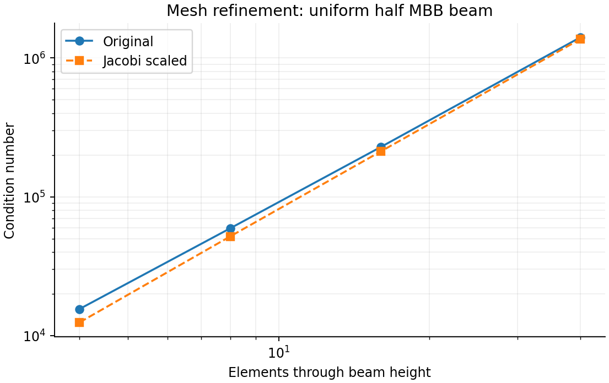
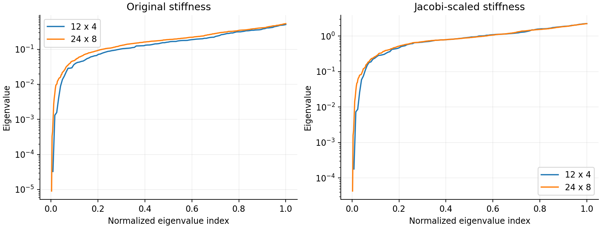
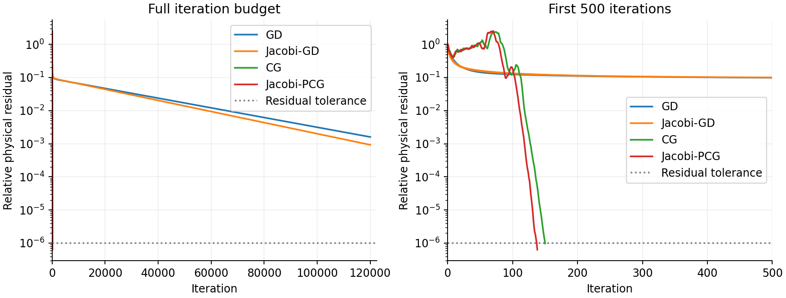
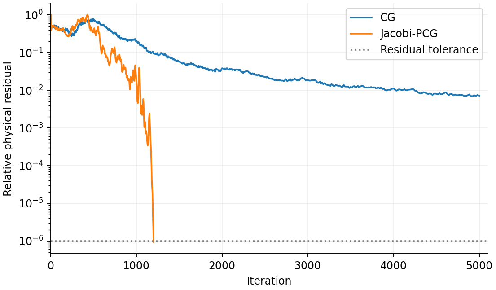

# Project 2: Ill-Conditioning in MBB Beam Analysis

**Course:** MAE 598/494 Design Optimization

**Team:** OptiForge

**Member:** Kangzheng Liu

**Assignment:** [Project 2: Ill-Conditioned Optimization](https://designinformaticslab.github.io/DesignOptimization2025/project2.html)

## 1. Problem Identification and Motivation

Structural engineers use finite-element analysis to predict how a component deforms under load. In topology optimization, this calculation is repeated whenever the material distribution changes. A finer mesh describes the structure in more detail, but can also make the equilibrium equations harder to solve iteratively.

This project uses the half MBB beam from [Project 1](../../01_problem_formulation/report/report.md). A downward unit load acts at the upper-left corner, horizontal motion is restrained along the left edge, and a roller supports the lower-right corner. For each prescribed material layout, the task is to find the displacement field that minimizes total potential energy.


We study how mesh refinement affects conditioning and gradient-descent convergence, then compare conjugate gradient and Jacobi preconditioning. The optimized material layout from Project 1 provides a second case with a large contrast between solid and void stiffness.

## 2. Formulation

The beam occupies a 120 by 40 domain with unit thickness. It is discretized using four-node square elements under plane stress. The mesh has $n_x=3n_y$ elements along its length and height, with element size $h=40/n_y$. Geometry, load, and supports remain fixed during refinement.

| Quantity | Definition | Value or admissible set |
|---|---|---|
| $\mathbf u\in\mathbb R^{n_d}$ | Continuous nodal displacement variables; units of length | $n_d=2(n_x+1)(n_y+1)$; prescribed support displacements below |
| $\mathbf u_f\in\mathbb R^{n_f}$ | Free displacement variables after imposing supports | $n_f=n_d-(n_y+2)$; no additional bounds |
| $\rho_e$ | Fixed, dimensionless element density | $0\leq\rho_e\leq1$ |
| $\mathbf F$ | Nodal force vector | Downward unit load at the upper-left node |
| $E_0,E_{\min}$ | Solid and void Young's moduli; units of force per area | $E_0=1$, baseline $E_{\min}=10^{-9}$ |
| $p,\nu$ | SIMP exponent and Poisson ratio | $p=3$, $\nu=0.3$ |

The calculation uses the normalized units of Project 1. Material stiffness follows the SIMP interpolation

$$
E_e=E_{\min}+\rho_e^p(E_0-E_{\min}).
$$

For the resulting assembled stiffness matrix $K$, the optimization problem is

$$
\begin{aligned}
\min_{\mathbf u\in\mathbb R^{n_d}}\quad
&\Pi(\mathbf u)=\frac12\mathbf u^{\mathsf T}K\mathbf u-\mathbf F^{\mathsf T}\mathbf u,\\
\text{s.t.}\quad
&u_x=0\quad\text{on the left edge},\\
&u_y=0\quad\text{at the lower-right corner}.
\end{aligned}
$$

The two terms represent strain energy and the potential of the applied load. Both have units of force times length. Eliminating the prescribed displacements gives

$$
\nabla\Pi(\mathbf u_f)=K_{ff}\mathbf u_f-\mathbf F_f,
\qquad H=\nabla^2\Pi=K_{ff}.
$$

Thus minimizing energy gives the equilibrium equation $K_{ff}\mathbf u_f=\mathbf F_f$. The positive material moduli and supports make $K_{ff}$ symmetric positive definite. The reduced problem is a continuous, deterministic, unconstrained, strictly convex quadratic with a unique minimizer. The 120 by 40 mesh has 9,880 free displacement variables.

## 3. Ill-Conditioning Mechanism

The main mechanism is the discretization of an elastic differential operator, corresponding to family B in the assignment. Smooth, collective deformations have low energy relative to rapidly varying local deformations. As the mesh is refined, the stiffness matrix represents an increasingly wide range of these deformation modes.

This can be seen using the admissible displacement $v_x=0$, $v_y=1-x/120$. Its strain energy remains fixed under refinement, while the sum of its squared nodal values grows as $h^{-2}$. The Rayleigh quotient therefore gives $\lambda_{\min}\leq C h^2$. Local stiffness entries provide a mesh-independent positive lower bound on $\lambda_{\max}$, so the condition number grows at least on the order of $h^{-2}$ for this sequence.

To examine whether individual variable scales explain the difficulty, we compare

$$
\kappa(K_{ff})=\frac{\lambda_{\max}(K_{ff})}{\lambda_{\min}(K_{ff})}
\quad\text{and}\quad
\kappa(J),\qquad
J=D^{-1/2}K_{ff}D^{-1/2},\quad D=\operatorname{diag}(K_{ff}).
$$

For a uniform density of 0.5, the results are:

| Mesh | Free variables | Original condition number | After Jacobi scaling |
|---|---:|---:|---:|
| 12 by 4 | 124 | 15,543 | 12,446 |
| 24 by 8 | 440 | 59,263 | 51,807 |
| 48 by 16 | 1,648 | 228,461 | 212,348 |
| 120 by 40 | 9,880 | 1,404,156 | 1,363,443 |



The condition number increases by roughly a factor of four when the resolution doubles. Diagonal scaling makes a modest difference and leaves the same growth trend. The difficulty therefore persists after correcting individual variable scales.

For these uniform meshes, each displacement receives diagonal stiffness contributions from one, two, or four identical elements. Hence $\kappa(D)\leq4$, and

$$
\kappa(J)\geq\frac{\kappa(K_{ff})}{\kappa(D)}
\geq\frac{\kappa(K_{ff})}{4}.
$$

This bound explains why Jacobi scaling cannot remove the mesh-dependent ill-conditioning.

## 4. Effect of Ill-Conditioning

The complete eigenvalue spectra of the two smaller meshes show the spread in curvature. The larger systems are characterized by their smallest and largest eigenvalues.



Gradient descent (GD) updates the free displacements as

$$
\mathbf u_{k+1}=\mathbf u_k-\alpha(K_{ff}\mathbf u_k-\mathbf F_f),
\qquad
\alpha=\frac{2}{\lambda_{\max}+\lambda_{\min}}.
$$

This is the optimal constant step for worst-case error contraction in a positive-definite quadratic. Its slowest-direction contraction factor is $q=(\kappa-1)/(\kappa+1)$. When $\kappa$ is large, $q$ is close to one and the error decreases slowly.

All methods start from zero displacement and use the same relative equilibrium residual:

$$
r_k=\frac{\|K_{ff}\mathbf u_k-\mathbf F_f\|_2}{\|\mathbf F_f\|_2}
\leq10^{-6}.
$$

The residual is explicitly recomputed before accepting convergence. The comparison includes GD, Jacobi-scaled GD, conjugate gradient (CG), and Jacobi-preconditioned CG (Jacobi-PCG). GD methods have a limit of 120,000 updates; CG methods have a limit of 5,000.

| Mesh | GD | Jacobi-GD | CG | Jacobi-PCG |
|---|---:|---:|---:|---:|
| 12 by 4 | 93,648 | 75,404 | 76 | 68 |
| 24 by 8 | Limit | Limit | 150 | 138 |
| 48 by 16 | Limit | Limit | 293 | 275 |
| 120 by 40 | — | — | 710 | 686 |

Entries are updates to the stated tolerance. “Limit” means the tolerance was not reached within 120,000 updates; a dash indicates a method was not run. At the limit, the GD and Jacobi-GD residuals are $1.60\times10^{-3}$ and $9.24\times10^{-4}$ on the 24 by 8 mesh, and $1.66\times10^{-2}$ and $1.56\times10^{-2}$ on the 48 by 16 mesh.



Even on the 12 by 4 mesh, GD requires 93,648 updates. Jacobi scaling reduces this to 75,404, consistent with its limited effect on the condition number. CG reaches the same tolerance in 76 updates. Its iteration count also grows under refinement, but remains much smaller than that of GD.

## 5. Proposed Solution and Demonstration

CG addresses the coupling between displacement variables by constructing search directions that are conjugate with respect to $K_{ff}$. This reduces repeated correction of errors along previously explored directions. For positive-definite quadratics, its convergence bound depends on $\sqrt{\kappa}$, compared with the $\kappa$ dependence of fixed-step GD.

Jacobi preconditioning rescales displacements according to their diagonal stiffness. With $\mathbf z=D^{1/2}\mathbf u_f$, the transformed Hessian is $J$. Jacobi-GD applies gradient descent in these coordinates, using the endpoints of $J$ to choose its step. Jacobi-PCG combines this scaling with conjugate search directions.

### Optimized material layout

The final layout from Project 1 contains stiff load paths surrounded by low-density regions. We keep this density field fixed on the 120 by 40 mesh and vary $E_{\min}$ to examine the effect of material contrast.


| $E_{\min}$ | Original condition number | After Jacobi scaling | Jacobi-PCG updates |
|---|---:|---:|---:|
| $10^{-3}$ | $2.310\times10^6$ | $1.127\times10^6$ | 1,229 |
| $10^{-6}$ | $1.281\times10^9$ | $1.132\times10^6$ | 1,216 |
| $10^{-9}$ | $1.188\times10^{12}$ | $1.132\times10^6$ | 1,201 |

The original condition number increases sharply as void stiffness decreases. Jacobi scaling removes most of this additional spread, leaving condition numbers near $1.13\times10^6$ and similar PCG iteration counts. The mesh experiment establishes the intrinsic conditioning problem, while this case shows how preconditioning handles the additional material scales.

At the original setting $E_{\min}=10^{-9}$, CG reaches a residual of $7.23\times10^{-3}$ after 5,000 updates. Jacobi-PCG reaches $9.27\times10^{-7}$ in 1,201 updates. The figure also shows the relative objective gap

$$
g_k=\frac{\Pi(\mathbf u_k)-\Pi(\mathbf u^\star)}
{\Pi(\mathbf 0)-\Pi(\mathbf u^\star)},
$$

where $\mathbf u^\star$ is obtained by a sparse direct solve. The code evaluates the numerator as $\tfrac12(\mathbf u_k-\mathbf u^\star)^{\mathsf T}K_{ff}(\mathbf u_k-\mathbf u^\star)$.



The reference compliance is 210.0406, matching Project 1. Jacobi-PCG reproduces this value with relative error below $10^{-10}$. Together, the two experiments show that CG substantially reduces the iteration count for the refined uniform beam, while Jacobi preconditioning is particularly effective for the large material contrast in the optimized layout.

## 6. Assumptions and Simplifications

The model assumes isotropic linear elasticity, small deformation, plane stress, unit thickness, and one static load case. Density is fixed during each solve. The unit load sets the normalization; scaling it down to keep deformation small leaves the condition numbers and relative-error comparisons unchanged.

The point load and single-node roller are retained from Project 1. The results concern conditioning and equilibrium-solver convergence for this discrete model. Stress limits, buckling, nonlinear deformation, and mesh convergence of local stresses are outside the study. Computational improvement is measured by iterations to a common residual tolerance.

## 7. Reproduction

Use Python 3.12 and run from the repository root:

```bash
python -m pip install -r projects/02_gradient_descent/requirements.txt
python projects/02_gradient_descent/src/conditioning_demo.py
```

The [script](../src/conditioning_demo.py) uses the FE routines and saved density from Project 1 and generates the figures and numerical results. The environment versions and seed are recorded in [metadata.json](../results/metadata.json). Condition numbers are in [conditioning.csv](../results/conditioning.csv), and iteration counts, final residuals, and errors are in [solvers.csv](../results/solvers.csv). The [results directory](../results/) includes the sampled convergence histories.

A small hand calculation checks both the condition number and iteration counts. For one solid square element with $\nu=0.3$, fixing all displacements except the two top-node vertical displacements gives

$$
H_{\mathrm{check}}=\frac1{91}
\begin{bmatrix}45&5\\5&45\end{bmatrix},
\qquad
\lambda_1=\frac{40}{91},\quad\lambda_2=\frac{50}{91},\quad\kappa=1.25.
$$

With $\mathbf b=(1,0)^{\mathsf T}$ and zero initial displacement, optimal fixed-step GD has relative residual $9^{-k}$, reaching $10^{-6}$ in seven updates; CG requires two. The code reproduces these values and checks the energy gradient, sparse eigenvalues, and Project 1 compliance. Results are saved in [verification.json](../results/verification.json).

## References

1. MAE 598/494, [Project 2: Ill-Conditioned Optimization](https://designinformaticslab.github.io/DesignOptimization2025/project2.html).
2. Kangzheng Liu, [Project 1: Formulation and Solution of a SIMP Topology-Optimization Problem](../../01_problem_formulation/report/report.md).
3. E. Andreassen, A. Clausen, M. Schevenels, B. S. Lazarov, and O. Sigmund, “Efficient topology optimization in MATLAB using 88 lines of code,” *Structural and Multidisciplinary Optimization*, 43, 1–16, 2011. [doi:10.1007/s00158-010-0594-7](https://doi.org/10.1007/s00158-010-0594-7).
