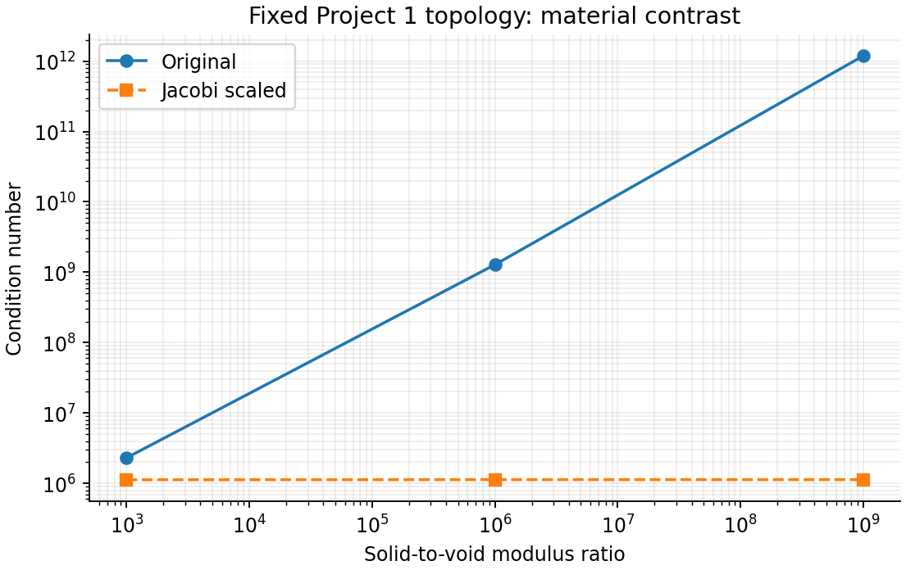

# Project 2: Ill-Conditioning in MBB Beam Analysis

**Course:** MAE 598/494 Design Optimization

**Team:** OptiForge

**Member:** Kangzheng Liu

**Status:** Working framework and verified pilot results — September 16, 2026

**Official brief:** [Project 2: Ill-Conditioned Optimization](https://designinformaticslab.github.io/DesignOptimization2025/project2.html)

## 1. Problem Identification and Motivation

[Project 1](../../01_problem_formulation/report/report.md) optimized the material distribution of a half MBB beam. Every density update required solving structural equilibrium to evaluate compliance and sensitivities. This project studies that repeated calculation: how difficult is it to minimize the beam's potential energy, and how can its numerical solution be improved?

The material distribution is fixed during each experiment. Displacements become the optimization variables. This retains the engineering model while isolating a convex problem whose conditioning can be measured directly.


The pilot has two parts. A uniform-density beam establishes how conditioning changes under mesh refinement. The saved final topology then shows how the same methods behave with the stiffness contrasts encountered in topology optimization.


## 2. Formulation

### 2.1 Model and variables

The model retains Project 1's four-node square elements, plane-stress elasticity, unit thickness, and half-MBB boundary conditions. The physical domain remains 120 by 40 in normalized length units. For each mesh, the element side is $h=40/n_y$ and $n_x=3n_y$. Uniform scaling of a square element's in-plane dimensions leaves its stiffness matrix unchanged: the $h^{-2}$ factor from displacement gradients cancels the $h^2$ area factor. The existing element matrix can therefore be reused at every resolution.

| Symbol | Meaning | Units / admissible set |
|---|---|---|
| $\mathbf u_f$ | Free nodal displacements; optimization variables | Length; continuous, $\mathbb R^{n_f}$ |
| $\rho_e$ | Prescribed element density | Dimensionless, $0\leq\rho_e\leq1$ |
| $\mathbf F_f$ | Applied force on free DOFs | Force; inherited downward unit nodal load |
| $K_{ff}$ | Supported stiffness matrix | Force / length; symmetric positive definite |
| $E_0,E_{\min}$ | Solid and void moduli | Force / area; $E_0=1$, baseline $E_{\min}=10^{-9}$ |
| $p,\nu$ | SIMP exponent and Poisson ratio | $p=3$, $\nu=0.3$ |

Density and material parameters are inputs, not variables of this displacement optimization. The original 120 by 40 mesh has 9,880 free displacement DOFs.

### 2.2 Objective and boundary conditions

The optimization problem is

$$
\min_{\mathbf u_f\in\mathbb R^{n_f}}
\Pi(\mathbf u_f)=\frac12\mathbf u_f^{\mathsf T}K_{ff}\mathbf u_f
-\mathbf F_f^{\mathsf T}\mathbf u_f.
$$

The first term is strain energy; the second is the potential of the applied load. Energy has units of force times length. The prescribed displacements are

$$
u_x=0\quad\text{on the left edge},\qquad
u_y=0\quad\text{at the lower-right node}.
$$

These DOFs are eliminated before optimization. The free variables have no additional bounds or constraints. Assembly uses the unchanged SIMP law

$$
E_e=E_{\min}+\rho_e^3(E_0-E_{\min}).
$$

The gradient and Hessian are

$$
\nabla\Pi=K_{ff}\mathbf u_f-\mathbf F_f,
\qquad H=\nabla^2\Pi=K_{ff}.
$$

At the minimum, the gradient vanishes and recovers equilibrium. Positive element moduli and the supports make the reduced problem strictly convex with a unique solution. It is a continuous, deterministic, unconstrained quadratic optimization problem. The original density optimization remains nonconvex; its density Hessian is a different object.

## 3. Ill-Conditioning Mechanism

### 3.1 Mesh refinement and the intrinsic test

The primary mechanism is family B: a discretized differential operator. Smooth collective deformations and rapidly varying local deformations have different energy costs. Refinement increases the range of spatial modes represented in the model.

The study measures

$$
\kappa(K_{ff})=\frac{\lambda_{\max}}{\lambda_{\min}},\qquad
J=D^{-1/2}K_{ff}D^{-1/2},\quad D=\operatorname{diag}(K_{ff}).
$$

For the uniform $\rho_e=0.5$ beam, the pilot gives:

| Mesh | Free DOFs | $\kappa(K_{ff})$ | $\kappa(J)$ |
|---|---:|---:|---:|
| 12 by 4 | 124 | 15,543 | 12,446 |
| 24 by 8 | 440 | 59,263 | 51,807 |
| 48 by 16 | 1,648 | 228,461 | 212,348 |
| 120 by 40 | 9,880 | 1,404,156 | 1,363,443 |


Both original and scaled systems become substantially more ill-conditioned. On the finest mesh, Jacobi scaling changes the condition number by only about 3%. This passes both parts of the intrinsic test.

There is also a structural reason why diagonal scaling cannot fix this sequence. With uniform material, the square element has equal diagonal entries, and a global DOF receives contributions from one, two, or four elements. Consequently $\kappa(D)\leq4$, which gives

$$
\kappa(J)\geq\frac{\kappa(K_{ff})}{\kappa(D)}
\geq\frac{\kappa(K_{ff})}{4}.
$$

Mesh-induced growth must therefore survive Jacobi scaling.

An admissible trial displacement $v_x=0$, $v_y=1-x/L$ provides a growth argument. Its stiffness quadratic form is independent of element size, whereas the squared Euclidean norm of its nodal values grows proportionally to $h^{-2}$. Its Rayleigh quotient is proportional to $h^2$, giving $\lambda_{\min}\leq C h^2$. Interior stiffness diagonals give a positive, mesh-independent lower bound on $\lambda_{\max}$. Thus the condition number grows at least on the order of $h^{-2}$ for this sequence. The code verifies the trial quadratic form and diagonal ratio on every uniform mesh.

The measured finite-grid trend is close to quadratic. We do not assert a sharp asymptotic law: the original roller constrains a single node, and its physical support region shrinks during refinement. This is second-order plane-stress elasticity, not a fourth-order beam-bending discretization.

### 3.2 Fixed topology and material contrast

The secondary experiment holds the saved 120 by 40 density field fixed while changing the void modulus. The density layout is not reoptimized.

| $E_{\min}$ | $\kappa(K_{ff})$ | $\kappa(J)$ |
|---|---:|---:|
| $10^{-3}$ | $2.310\times10^6$ | $1.127\times10^6$ |
| $10^{-6}$ | $1.281\times10^9$ | $1.132\times10^6$ |
| $10^{-9}$ | $1.188\times10^{12}$ | $1.132\times10^6$ |



Much of the additional conditioning caused by weak void elements is removed by Jacobi scaling. The remaining condition number is still large, but barely changes with $E_{\min}$ in this sweep. Material contrast is therefore an application study, not the main evidence for intrinsic growth. A large raw condition number alone would miss this distinction.

## 4. Effect of Ill-Conditioning

### 4.1 Spectrum and baseline

Full eigenvalue spectra are calculated on the 12 by 4 and 24 by 8 meshes. Larger cases use sparse calculations of the two spectral endpoints. No full spectrum is inferred from endpoint estimates.


The baseline is gradient descent from zero displacement:

$$
\mathbf u_{k+1}=\mathbf u_k-\alpha(K_{ff}\mathbf u_k-\mathbf F_f),
\qquad \alpha=\frac{2}{\lambda_{\max}+\lambda_{\min}}.
$$

This is the best constant step in the worst-case spectral sense for an SPD quadratic. The baseline is therefore not slowed by an arbitrary small step. Eigenvalue estimation is diagnostic setup work and is not included in solver timings.

With this step, the worst-direction displacement error contracts by $q=(\kappa-1)/(\kappa+1)$ per update. A large condition number makes $q$ close to one, explaining the slow baseline convergence.

All methods are accepted against the same physical residual:

$$
r_k=\frac{\|K_{ff}\mathbf u_k-\mathbf F_f\|_2}{\|\mathbf F_f\|_2}
\leq10^{-6}.
$$

The GD budget is 120,000 updates and the CG/PCG budget is 5,000. The final residual is explicitly recomputed from the original system. SciPy's CG stopping test uses its recursive residual; success is recorded only if the independently recomputed physical residual also passes.

### 4.2 Pilot convergence results

| Mesh | GD | Jacobi-GD | CG | Jacobi-PCG |
|---|---:|---:|---:|---:|
| 12 by 4 | 93,648 | 75,404 | 76 | 68 |
| 24 by 8 | Cap; $r=1.60\times10^{-3}$ | Cap; $r=9.24\times10^{-4}$ | 150 | 138 |
| 48 by 16 | Cap; $r=1.66\times10^{-2}$ | Cap; $r=1.56\times10^{-2}$ | 293 | 275 |
| 120 by 40 | Not run | Not run | 710 | 686 |

Numbers without a qualifier are updates to the common residual tolerance. “Cap” means the method exhausted 120,000 updates without meeting it; the cap is not a convergence count.


On the smallest mesh, GD needs about 1,232 times as many updates as CG. This is an iteration comparison, not a wall-clock speedup claim. Under refinement, CG also needs more iterations, while Jacobi gives only a modest additional improvement for the uniform beam.

The companion energy measure is

$$
g_k=\frac{(\mathbf u_k-\mathbf u^\star)^{\mathsf T}K_{ff}
(\mathbf u_k-\mathbf u^\star)}
{(\mathbf u^\star)^{\mathsf T}K_{ff}\mathbf u^\star}
=\frac{\Pi(\mathbf u_k)-\Pi(\mathbf u^\star)}
{\Pi(\mathbf 0)-\Pi(\mathbf u^\star)}.
$$

This avoids subtracting nearly equal energies. The reference $\mathbf u^\star$ is obtained by a sparse direct solve. The uniform-beam figure shows the full residual history and an early-iteration detail. The topology figure below shows residual and energy error on separate axes.

## 5. Proposed Solution and Demonstration

CG builds search directions that are conjugate with respect to the stiffness matrix. For an SPD quadratic, its error bound depends on $\sqrt{\kappa}$ rather than the $\kappa$ dependence of fixed-step GD. Its improvement does not change the original Hessian. Eigenvalue distribution and the loaded modes also affect the observed count.

Jacobi preconditioning additionally rescales the unknowns using the diagonal stiffness. The two implementations are

$$
\mathbf u_{k+1}=\mathbf u_k-\alpha_J D^{-1}(K_{ff}\mathbf u_k-\mathbf F_f)
$$

for Jacobi-GD, and preconditioner $M=D$ for PCG. The step $\alpha_J$ is calculated from the endpoints of $J$. The diagonal is positive, so this preconditioner is compatible with CG.

The final Project 1 topology provides a practical test:

| $E_{\min}$ | CG residual after 5,000 updates | Jacobi-PCG updates | Final PCG residual |
|---|---:|---:|---:|
| $10^{-3}$ | $2.31\times10^{-5}$ | 1,229 | $9.36\times10^{-7}$ |
| $10^{-6}$ | $1.71\times10^{-2}$ | 1,216 | $8.70\times10^{-7}$ |
| $10^{-9}$ | $7.23\times10^{-3}$ | 1,201 | $9.27\times10^{-7}$ |


CG does not reach the tolerance within its budget in these cases. Jacobi-PCG does, with similar counts across the three void moduli. This agrees with the nearly constant scaled condition numbers.

At the original $E_{\min}=10^{-9}$, the direct reference compliance is 210.0405711590, reproducing Project 1's 210.0405711598. PCG's relative full-displacement error is about $3.1\times10^{-5}$ even though its compliance error is below $10^{-10}$. Weakly constrained void displacements can be less accurate while contributing little to compliance. The data also record displacement, energy, and compliance errors.

## 6. Assumptions and Simplifications

The structural assumptions remain linear elasticity, small deformation, plane stress, and one static load case. Each optimization uses a fixed density field. No OC updates or sensitivity filtering are performed inside the solver comparison.

The unit force is a linear-model normalization. Reducing its magnitude to keep deformation small leaves the condition numbers and relative-error comparisons unchanged.

Point loading and the single-node roller are retained to match Project 1. The refinement experiment does not establish mesh convergence of stress or compliance. All computations use float64, and the very small void modulus requires care when interpreting the smallest eigenvalues. Condition numbers are rounded accordingly.

The present results establish a feasible project direction. They do not show an acceleration of the complete SIMP-OC pipeline or a mesh-independent solver. Single-run timings include monitoring overhead and are retained for transparency, not used as performance claims.

## 7. Reproduction and Verification

Use Python 3.12 and run from the repository root:

```bash
python -m pip install -r projects/02_gradient_descent/requirements.txt
python projects/02_gradient_descent/src/conditioning_demo.py
```

The demo imports Project 1's FE routines and reads its density CSV. It writes only Project 2 outputs. To keep the committed pilot data intact during a rerun:

```bash
python projects/02_gradient_descent/src/conditioning_demo.py --output /tmp/mae598-project2
```

Verification includes a hand-solvable FE restriction. For a unit square element with $\nu=0.3$, retain only the two top-node vertical DOFs and fix all others:

$$
H_{\mathrm{check}}=\frac1{91}
\begin{bmatrix}45&5\\5&45\end{bmatrix},\qquad
\lambda=\left\{\frac{40}{91},\frac{50}{91}\right\},\qquad\kappa=1.25.
$$

This checks the diagnostic calculation and is not the project's main model. Further checks compare dense and sparse eigenvalues on a 6 by 2 MBB mesh, verify the energy gradient and energy-gap identity, check the affine trial quadratic form and Jacobi bound, and reproduce the saved Project 1 compliance. Sparse eigenpair backward residuals are stored with the results; they are normalized by the largest eigenvalue, not by the smallest eigenvalue.

| File | Contents |
|---|---|
| [conditioning_demo.py](../src/conditioning_demo.py) | Assembly adapter, diagnostics, algorithms, checks, and plots |
| [conditioning.csv](../results/conditioning.csv) | Spectral endpoints, condition numbers, and reference solves |
| [solvers.csv](../results/solvers.csv) | Convergence status, iterations, errors, and pilot timings |
| [results directory](../results/) | Sampled histories and complete small-mesh spectra |
| [verification.json](../results/verification.json) | Independent numerical checks |
| [metadata.json](../results/metadata.json) | Versions, seed, thread settings, and input hashes |

## 8. Plan for the Final Submission

The six sections above cover the engineering model, formulation, intrinsic mechanism, baseline effect, remedy, and assumptions. The final write-up can tighten this working draft around four questions: what is optimized, why it is ill-conditioned, how much that slows GD, and why CG/preconditioning help.

Before submission, check GitHub's rendered equations and figures and prepare a short presentation of the mesh and topology experiments. If runtime comparisons are added, use repeated solves with consistent monitoring and report setup separately. A stronger SPD preconditioner is an optional extension only if reducing the remaining mesh dependence is useful; the current pilot already supplies the required before/after evidence.

A density-space volume-penalty study is a possible alternative, but it would add active density bounds, nonconvex curvature, and the distinction between true and filtered sensitivities. It is outside the selected scope. A complete SIMP-OC speedup study is also beyond the present pilot.

See the [Chinese framework and evaluation](framework_zh.md) for the planning rationale.

## References

1. MAE 598/494, [Project 2: Ill-Conditioned Optimization](https://designinformaticslab.github.io/DesignOptimization2025/project2.html).
2. Kangzheng Liu, [Project 1 report](../../01_problem_formulation/report/report.md), [FE implementation](../../01_problem_formulation/src/top88.py), and [saved density field](../../01_problem_formulation/results/final_density.csv).
3. E. Andreassen et al., “Efficient topology optimization in MATLAB using 88 lines of code,” *Structural and Multidisciplinary Optimization*, 43, 1–16, 2011. [DOI](https://doi.org/10.1007/s00158-010-0594-7). The FE implementation and MBB benchmark are inherited from Project 1's reproduction of this method.
