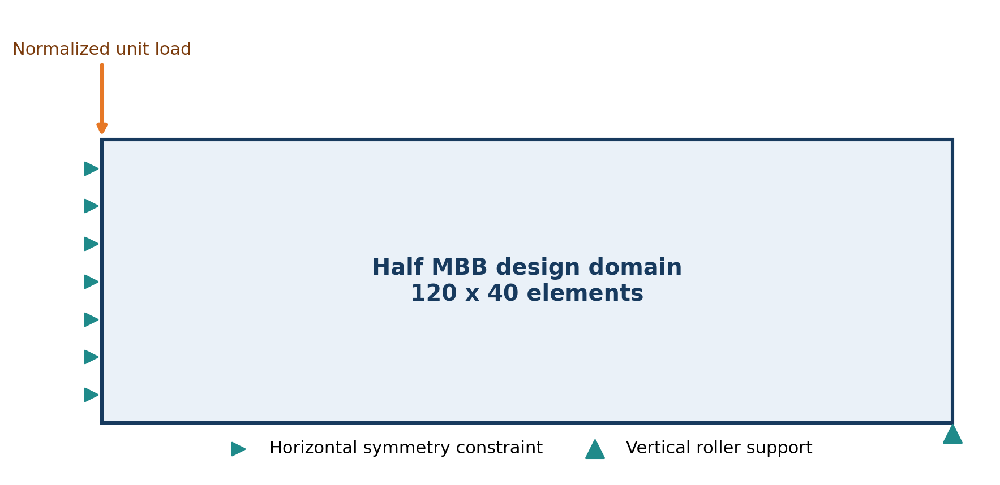
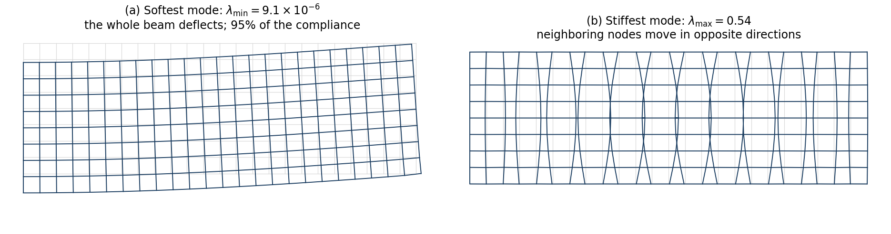
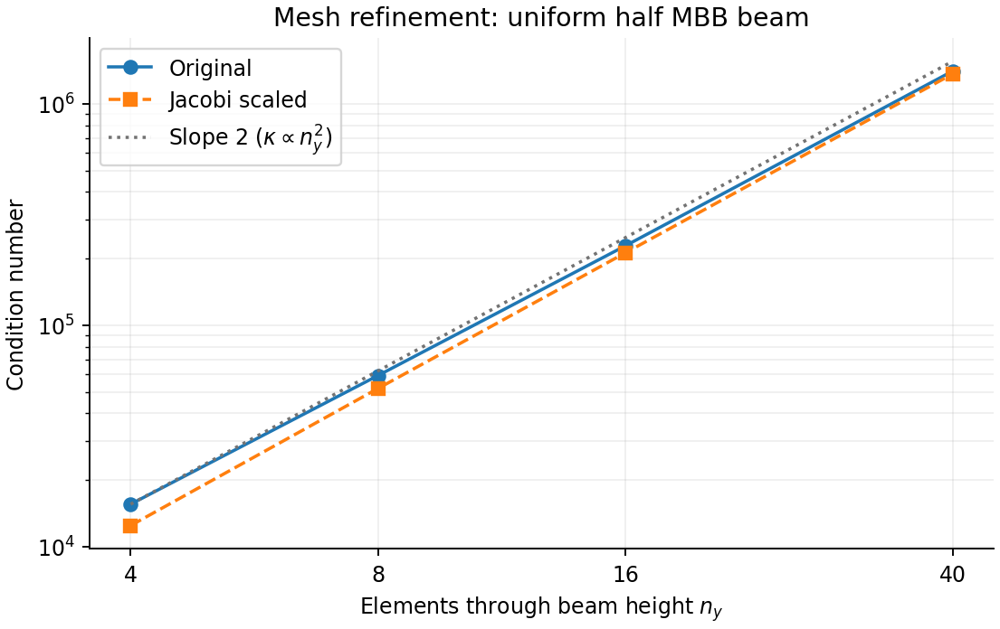
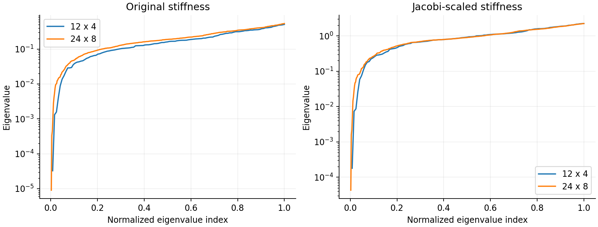
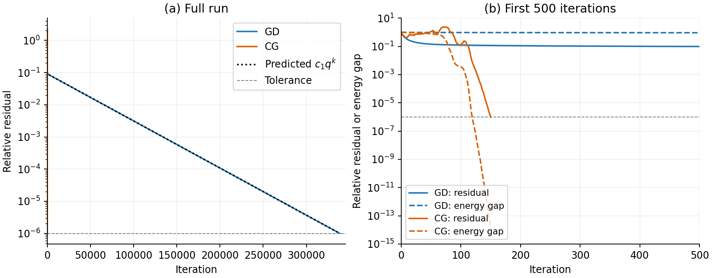
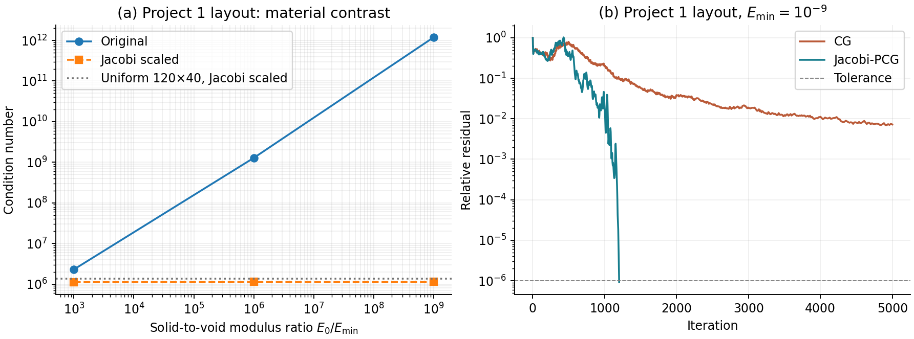
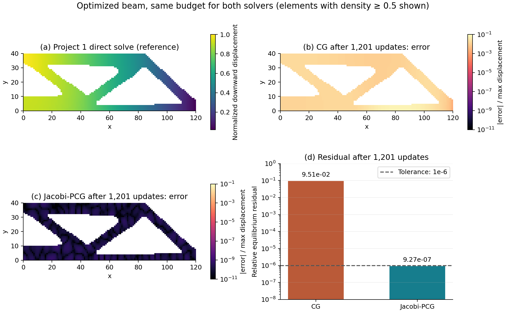

# Project 2: Solving the MBB Beam Equilibrium Problem

**Kangzheng Liu · OptiForge · MAE 598/494 Design Optimization**

## 1. Problem and Motivation

[Project 1](../../01_problem_formulation/report/report.md) optimized the material layout of a half MBB beam. Every design update needed the beam's displacement under load, which means solving the equilibrium equations $K\mathbf u=\mathbf F$. Project 1 used a sparse direct solver. With 9,880 unknowns this takes less than a tenth of a second, so the solve was never a concern.

It becomes one at scale. Practical topology optimization is done in 3D with millions of unknowns or more [3, 4]. Factorizing $K$ then costs too much memory and time, so large codes use iterative solvers built on the conjugate gradient method (CG) [3]. The speed of an iterative solver depends on the condition number of $K$, and topology optimization makes it large in two ways: fine meshes, and the huge stiffness gap between solid and void material. Because the solve repeats at every design update, its cost sets how large a design an engineer can afford to optimize.

This project treats the equilibrium solve as an optimization problem and asks two questions:

1. Why is gradient descent (GD) so slow here, and can we predict how slow?
2. What fixes each source of ill-conditioning, and why does the fix work?

We keep the Project 1 beam, load, and supports: a downward unit force at the upper-left corner, $u_x=0$ along the left (symmetry) edge, and $u_y=0$ at the lower-right corner.



We first use uniform material on four meshes to isolate mesh refinement. We then solve on the optimized Project 1 layout, which adds solid–void contrast, and check the result against the Project 1 direct solution.

## 2. Formulation

The beam is 120 by 40 with unit thickness, in the normalized units of Project 1. As in top88 [5], it is divided into square, four-node plane-stress elements, with $n_x=3n_y$ and element size $h=40/n_y$.

| Quantity | Meaning and units | Values or bounds |
|---|---|---|
| $\mathbf u$ | Nodal displacements (decision variables); continuous; length | $2(n_x+1)(n_y+1)$ components; support constraints below |
| $\rho_e$ | Element material fraction, fixed during a solve; dimensionless | $0\leq\rho_e\leq1$ |
| $\mathbf F$ | Applied nodal forces; force | Downward unit load |
| $E_0,E_{\min}$ | Solid and void moduli; force per area | $E_0=1$, $E_{\min}=10^{-9}$ |
| $p,\nu$ | SIMP exponent and Poisson ratio; dimensionless | $p=3$, $\nu=0.3$ |

As in Project 1, element $e$ has modulus $E_e=E_{\min}+\rho_e^p(E_0-E_{\min})$. The stiffness matrix sums one unit-modulus $8\times8$ element matrix $\mathbf k_0$, scaled by each element's modulus:

```math
K=\sum_e E_e\,P_e^{\mathsf T}\mathbf k_0P_e,
```

where $P_e$ selects the element's eight displacement components. The displacement minimizes total potential energy:

```math
\begin{aligned}
\min_{\mathbf u}\quad &\Pi(\mathbf u)=\frac12\mathbf u^{\mathsf T}K\mathbf u-\mathbf F^{\mathsf T}\mathbf u,\\
\text{s.t.}\quad &u_x=0\quad\text{on the left edge},\\
&u_y=0\quad\text{at the lower-right corner}.
\end{aligned}
```

The objective is strain energy minus the work of the applied force, with units of force times length. After removing the fixed displacements, the free displacements $\mathbf u_f$ have no bounds. Their gradient and Hessian are

```math
\nabla\Pi=K_{ff}\mathbf u_f-\mathbf F_f,
\qquad H=K_{ff}.
```

Setting the gradient to zero gives the equilibrium equation $K_{ff}\mathbf u_f=\mathbf F_f$. $K_{ff}$ is symmetric positive definite for two reasons. Every $E_e$ is positive, which is why $E_{\min}$ is not zero. The supports also remove all rigid-body motion: the left edge blocks horizontal translation and rotation, and the corner roller blocks vertical translation.

So this is an unconstrained, continuous, deterministic, strictly convex quadratic problem with a unique solution. It has $2(n_x+1)(n_y+1)-(n_y+2)$ free variables, or 9,880 on the Project 1 mesh. Because $\Pi$ is exactly quadratic, the Hessian is the same everywhere. The quadratic-bowl picture used to define conditioning is exact here, not an approximation near the minimum.

## 3. Why the Problem Is Ill-Conditioned

Each eigenvector $\mathbf v$ of $H$ is a deformation shape. Its eigenvalue is the stiffness of that shape, the Rayleigh quotient

```math
\lambda=\frac{\mathbf v^{\mathsf T}H\mathbf v}{\mathbf v^{\mathsf T}\mathbf v},
```

where the numerator is twice the strain energy of the shape. The condition number $\kappa=\lambda_{\max}/\lambda_{\min}$ compares the stiffest shape with the softest one. Mesh refinement makes this ratio large, which is **family B** of the assignment: a discretized differential operator. The optimized layout adds a second source, family A, treated in Section 5.2. The figure shows the two extreme shapes on the 24 by 8 mesh.



**The stiffest shape has the shortest wavelength.** Neighboring nodes move in opposite directions, so the strain is as large as the mesh allows and the energy is stored element by element. In 2D, the element matrix does not depend on element size: strains scale as $1/h$ and element area as $h^2$, and the two cancel. $\lambda_{\max}$ therefore stays almost fixed as the mesh is refined.

**The softest shape is smooth and global.** The whole beam deflects on its support. This is essentially how the beam responds to the load; this one mode carries 93–96% of the compliance on all four meshes. For a fixed smooth shape, $\mathbf v^{\mathsf T}H\mathbf v$ does not change with the mesh, but $\mathbf v^{\mathsf T}\mathbf v$ sums over all nodes and grows as $1/h^2$. Its Rayleigh quotient therefore falls as $h^2$.

A trial shape makes this concrete. Take $v_x=0$, $v_y=1-x/120$, which satisfies both supports. It is a uniform shear $\gamma=1/120$ over area 4,800, so $\mathbf v^{\mathsf T}H\mathbf v=G\gamma^2\cdot4800=E/7.8$ on every mesh, with $G=E/2.6$ and $E=0.125$ the modulus at density 0.5. Meanwhile $\mathbf v^{\mathsf T}\mathbf v\approx(n_x+1)(n_y+1)/3$. Hence

```math
\lambda_{\min}\leq\frac{\mathbf v^{\mathsf T}H\mathbf v}{\mathbf v^{\mathsf T}\mathbf v}\approx\frac{E/7.8}{(n_x+1)(n_y+1)/3}\propto h^2,
```

so $\kappa$ must grow at least as fast as $n_y^2$.

To test this, we set every density to 0.5 and refine the mesh with the beam size fixed.

| Mesh | Free variables | $\lambda_{\min}$ | $\lambda_{\max}$ | $\kappa$ | $\kappa$ after Jacobi scaling |
|---|---:|---:|---:|---:|---:|
| 12 by 4 | 124 | $3.26\times10^{-5}$ | 0.507 | 15,543 | 12,446 |
| 24 by 8 | 440 | $9.06\times10^{-6}$ | 0.537 | 59,263 | 51,807 |
| 48 by 16 | 1,648 | $2.39\times10^{-6}$ | 0.546 | 228,461 | 212,348 |
| 120 by 40 | 9,880 | $3.91\times10^{-7}$ | 0.549 | 1,404,156 | 1,363,443 |

$\lambda_{\max}$ barely moves while $\lambda_{\min}$ falls as $h^2$. The fitted log–log slope of $\kappa$ against $n_y$ is 1.96, close to the predicted 2. The 1-D Poisson example in the assignment has the same rate, because both are second-order differential operators.



**Diagonal scaling cannot remove it.** Jacobi scaling uses

```math
D=\mathrm{diag}(H),\qquad J=D^{-1/2}HD^{-1/2}.
```

On a uniform mesh, each diagonal entry of $H$ is the same element value times the number of elements sharing the node: 1, 2, or 4. The diagonal varies by at most a factor of 4, so $\kappa(J)\geq\kappa(H)/4$. Jacobi scaling corrects variables whose scales differ. Here all variables have nearly the same scale; the softest and stiffest shapes differ in wavelength, smooth across the whole beam versus alternating from node to node. The measurements agree: scaling lowers $\kappa$ by only 3–20%, and the slope stays near 2 (2.04). The ill-conditioning passes both parts of the intrinsic test (D2).

The full spectra of the two smaller meshes (D1) show the same picture. On the 24 by 8 mesh, only 10 of the 440 eigenvalues lie below $10^{-2}$. The softest one sits alone, 36 times below the next. Jacobi scaling shifts the spectrum up without changing its shape.



## 4. Effect on Gradient Descent

GD with the best constant step updates the displacement as

```math
\mathbf u_{k+1}=\mathbf u_k-\alpha(K_{ff}\mathbf u_k-\mathbf F_f),
\qquad \alpha=\frac{2}{\lambda_{\max}+\lambda_{\min}}.
```

Each update multiplies the error along eigenvector $i$ by $1-\alpha\lambda_i$. The stiffest mode limits the step size, and the softest mode then shrinks by only

```math
q=\frac{\kappa-1}{\kappa+1}=1-\frac{2}{\kappa+1}
```

per update, as in the [gradient-descent lectures](https://designinformaticslab.github.io/DesignOptimization2025/gradient_descent_pt1_2025.html). The stiffest mode is multiplied by $-q$, so it decays just as slowly, but the load barely excites it: on the 24 by 8 mesh its share of the load is $4\times10^{-4}$, against 0.092 for the softest mode.

All methods start from zero displacement. They stop when the unbalanced force falls below one millionth of the applied force:

```math
r_k=\frac{\lVert K_{ff}\mathbf u_k-\mathbf F_f\rVert_2}{\lVert\mathbf F_f\rVert_2}\leq10^{-6}.
```

This relative residual is also the normalized gradient norm.

**The GD count can be predicted.** Once the other components have died out (after about a thousand updates on the 24 by 8 mesh), the residual lies almost entirely along the softest mode $\mathbf v_1$. Its size there is set by the load's share on that mode, $c_1=|\mathbf v_1^{\mathsf T}\mathbf F_f|/\lVert\mathbf F_f\rVert_2$. From then on $r_k\approx c_1q^k$, so GD needs

```math
k=\frac{\ln(c_1/10^{-6})}{\ln(1/q)}\approx\frac{\kappa}{2}\ln\frac{c_1}{10^{-6}}
```

updates.

| Mesh | $\kappa$ | $c_1$ | Predicted GD updates | Measured GD updates |
|---|---:|---:|---:|---:|
| 12 by 4 | 15,543 | 0.171 | 93,647 | 93,648 |
| 24 by 8 | 59,263 | 0.092 | 338,559 | 338,559 |
| 48 by 16 | 228,461 | 0.047 | 1,229,961 | 1,229,961 |
| 120 by 40 | 1,404,156 | 0.019 | 6,929,438 | Not run |

The prediction matches to within one update. Each mesh doubling costs GD about 3.6 times more updates. On the Project 1 mesh it would need about 6.9 million.



The figure gives the convergence curves (D3). Panel (a) shows the two phases on the 24 by 8 mesh. The residual first drops to about $c_1=0.09$ as the other components die out. It then follows $c_1q^k$ (dotted line) for over 300,000 updates.

The residual is misleading in the slow phase. Panel (b) also plots the relative energy gap

```math
g_k=\frac{\Pi(\mathbf u_k)-\Pi(\mathbf u^\star)}{\Pi(\mathbf 0)-\Pi(\mathbf u^\star)}.
```

After 1,000 updates, the residual is 0.09 but $g_k$ is still 0.89. The missing part is the softest mode, where the error equals the residual divided by $\lambda_1$. A small residual along a soft mode can hide a large displacement error.

Jacobi-scaled GD helps little. It needs 75,404, 296,896, and 1,145,230 updates on the three smaller meshes. These savings (1.24, 1.14, and 1.07 times) match the drops in $\kappa$ in Section 3, as expected when the update count scales with $\kappa$.

## 5. Improving the Solver

### 5.1 Mesh refinement: conjugate gradient

Diagonal scaling cannot fix the mesh part, so the fix has to change how search directions are chosen. CG, covered in the [second gradient-descent lecture](https://designinformaticslab.github.io/DesignOptimization2025/gradient_descent_pt2_2025.html), makes each new direction conjugate, with respect to $K_{ff}$, to all earlier ones. After $k$ updates it has the lowest-energy displacement among all combinations of the first $k$ residuals, so it never undoes earlier progress. In eigenvalue terms, GD applies the fixed factor $(1-\alpha\lambda)^k$; CG picks the best degree-$k$ polynomial for the whole spectrum. Its standard error bound depends on $\sqrt\kappa$ instead of $\kappa$ [6]:

```math
\lVert\mathbf e_k\rVert_{K}\leq2\left(\frac{\sqrt\kappa-1}{\sqrt\kappa+1}\right)^k\lVert\mathbf e_0\rVert_{K}.
```

Since $\kappa$ grows as $n_y^2$, CG updates should grow as $n_y$.

| Mesh | GD updates | CG updates | CG updates / $\sqrt\kappa$ |
|---|---:|---:|---:|
| 12 by 4 | 93,648 | 76 | 0.61 |
| 24 by 8 | 338,559 | 150 | 0.62 |
| 48 by 16 | 1,229,961 | 293 | 0.61 |
| 120 by 40 | About 6.9 million (predicted) | 710 | 0.60 |

CG updates double when the mesh doubles, while GD updates grow 3.6 times. On the Project 1 mesh, CG needs 710 updates in place of about 6.9 million. This table and the convergence figure in Section 4 give the before-and-after comparison (D4).

CG's residual is not monotone (panel b above). CG minimizes the energy error, not the residual, and its energy gap falls at every update.

CG still slows down as the mesh is refined. A count that does not depend on the mesh needs a preconditioner that treats smooth modes on coarser grids, such as multigrid. Large-scale topology optimization codes use this combination [3].

### 5.2 Material contrast: Jacobi preconditioning

The optimized Project 1 layout adds a second, different source of ill-conditioning. Near-void elements have modulus $10^{-9}$. Nodes attached only to void elements have stiffness proportional to $E_{\min}$, so the softest modes are deformations of the void material itself: $\lambda_{\min}\approx3.5\times10^{-3}E_{\min}$ for $E_{\min}\leq10^{-6}$, and $\kappa$ reaches $1.19\times10^{12}$. This is family A (multiscale stiffness).

Unlike the mesh part, this source shows up in the diagonal: a void node's diagonal entry is also proportional to $E_{\min}$. Dividing each variable by its own stiffness brings the void modes back to the scale of the solid. Panel (a) shows the result: $\kappa(J)$ is $1.13\times10^6$ for every $E_{\min}$, close to the uniform 120 by 40 mesh ($1.36\times10^6$, dotted line). Jacobi scaling removes the contrast part and leaves the mesh part. By the assignment's test, the contrast part is not intrinsic and the mesh part is. Jacobi-preconditioned CG (Jacobi-PCG) therefore combines the two fixes: Jacobi scaling for the contrast and CG for the mesh.



| 120 by 40 layout | $\kappa$ | $\kappa$ after Jacobi | CG updates | Jacobi-PCG updates |
|---|---:|---:|---:|---:|
| Uniform (mesh only) | $1.40\times10^6$ | $1.36\times10^6$ | 710 | 686 |
| Project 1, $E_{\min}=10^{-9}$ (mesh and contrast) | $1.19\times10^{12}$ | $1.13\times10^6$ | Not converged after 5,000 ($r=7.2\times10^{-3}$) | 1,201 |

The figure and table give the before-and-after evidence for this fix (D4). The same preconditioner saves 3% on the uniform mesh and turns a failed solve into a 1,201-update solve on the optimized layout. It helps where the ill-conditioning comes from mismatched variable scales. The count also barely depends on the contrast: 1,229, 1,216, and 1,201 updates for $E_{\min}=10^{-3}$, $10^{-6}$, and $10^{-9}$.

Jacobi-PCG still needs more updates on the optimized layout than on the uniform mesh (1,201 against 686), although $\kappa(J)$ is slightly lower. The $\sqrt\kappa$ bound is only an upper bound; CG's actual count also depends on how many eigenvalues are small. After Jacobi scaling, the optimized layout has 17 eigenvalues below $10^{-3}$, against 6 for the uniform mesh.

### 5.3 Check against Project 1

The Project 1 direct solution is the reference. CG gets the same 1,201 updates that Jacobi-PCG needed.



| Method | Updates | Relative residual | Compliance | Displacement error on the structure |
|---|---:|---:|---:|---:|
| Project 1: direct solve | — | $3.48\times10^{-12}$ | 210.040571 | Reference |
| CG | 1,201 | $9.51\times10^{-2}$ | 206.318024 | $2.9\times10^{-2}$ |
| Jacobi-PCG | 1,201 | $9.27\times10^{-7}$ | 210.040571 | $4.9\times10^{-10}$ |

The last column is the relative displacement error over nodes that touch an element with density at least 0.5. The maps show the same elements. Void displacements carry no load and are poorly determined: with stiffness near $10^{-9}$, a tiny residual still allows a large error. Even converged Jacobi-PCG differs from the direct solve by $5\times10^{-5}$ in the void, against $5\times10^{-10}$ on the structure.

Jacobi-PCG reproduces the Project 1 compliance to 11 significant digits. CG with the same budget underestimates it by 1.8%, and this error always has the same sign. CG minimizes $\Pi$ over a subspace that contains $\mathbf u_k$, which gives $\mathbf F_f^{\mathsf T}\mathbf u_k=\mathbf u_k^{\mathsf T}K_{ff}\mathbf u_k$ and $\Pi(\mathbf u_k)=-\tfrac12\mathbf F_f^{\mathsf T}\mathbf u_k$. As $\Pi(\mathbf u_k)$ falls, the compliance estimate rises toward the true value from below. A truncated CG solve therefore makes a design look stiffer than it is. Its 3% displacement error on the structure would also distort the Project 1 sensitivities, which are quadratic in the element displacements.

At this size, the direct solve is still faster: under 0.1 s against about 0.2 s for Jacobi-PCG on our machine. Iterative solvers win only at much larger sizes, as in [3, 4]; this project does not reach that regime.

## 6. Assumptions and Limitations

- The model uses small-deformation, isotropic linear elasticity, plane stress, unit thickness, and one static load case.
- Each solve uses a fixed density field and starts from zero. Inside an optimization loop, $K$ changes slightly at each design update. Starting from the previous displacement would cut the iteration count, and the preconditioner would need rebuilding each time. We do not model this.
- GD uses the best constant step, computed from the exact extreme eigenvalues. This favors GD; in practice those values are unknown.
- Performance is measured in updates. Each GD, CG, or Jacobi-PCG update costs about one sparse matrix–vector product.
- The load magnitude does not affect $\kappa$ or the relative residuals, because $K$ does not depend on $\mathbf F$.

## Reproduction

Use Python 3.12 and run from the repository root:

```bash
python -m pip install -r projects/02_gradient_descent/requirements.txt
python projects/02_gradient_descent/src/conditioning_demo.py
```

The run takes about 2.5 minutes, mostly for GD on the three smaller meshes. The [code](../src/conditioning_demo.py) reads the Project 1 FE model and saved density. The [results](../results/) contain condition numbers, the GD prediction, solver histories, the Project 1 comparison, and environment metadata.

For a hand check, fixing all but the two upper vertical displacements of one solid square element gives

```math
H_{\mathrm{check}}=\frac1{91}
\begin{bmatrix}
45 & 5 \\
5 & 45
\end{bmatrix}.
```

Its eigenvalues are $40/91$ and $50/91$, so $\kappa=1.25$ and $q=0.25/2.25=1/9$. The load $(1,0)^{\mathsf T}$ splits equally between the two eigenvectors, so GD gives exactly $r_k=9^{-k}$. Since $9^{-6}=1.9\times10^{-6}$ and $9^{-7}=2.1\times10^{-7}$, GD needs seven updates. CG needs two, since it finishes in at most as many updates as there are unknowns.

[verification.json](../results/verification.json) records this check and several others: a finite-difference test of the energy gradient, sparse against dense eigenvalues, the trial-shape energy $E/7.8$ and the bound $\kappa(J)\geq\kappa(H)/4$ on every uniform mesh, and the GD prediction within 0.1%.

## References

1. MAE 598/494, [Project 2: Ill-Conditioned Optimization](https://designinformaticslab.github.io/DesignOptimization2025/project2.html).
2. Kangzheng Liu, [Project 1: SIMP–OC Topology Optimization](../../01_problem_formulation/report/report.md).
3. O. Amir, N. Aage, and B. S. Lazarov, “On multigrid-CG for efficient topology optimization,” *Structural and Multidisciplinary Optimization*, 49, 815–829, 2014. [doi:10.1007/s00158-013-1015-5](https://doi.org/10.1007/s00158-013-1015-5).
4. N. Aage, E. Andreassen, B. S. Lazarov, and O. Sigmund, “Giga-voxel computational morphogenesis for structural design,” *Nature*, 550, 84–86, 2017. [doi:10.1038/nature23911](https://doi.org/10.1038/nature23911).
5. E. Andreassen et al., “Efficient topology optimization in MATLAB using 88 lines of code,” *Structural and Multidisciplinary Optimization*, 43, 1–16, 2011. [doi:10.1007/s00158-010-0594-7](https://doi.org/10.1007/s00158-010-0594-7).
6. J. Nocedal and S. J. Wright, *Numerical Optimization*, 2nd ed., Springer, 2006, Section 5.1.
